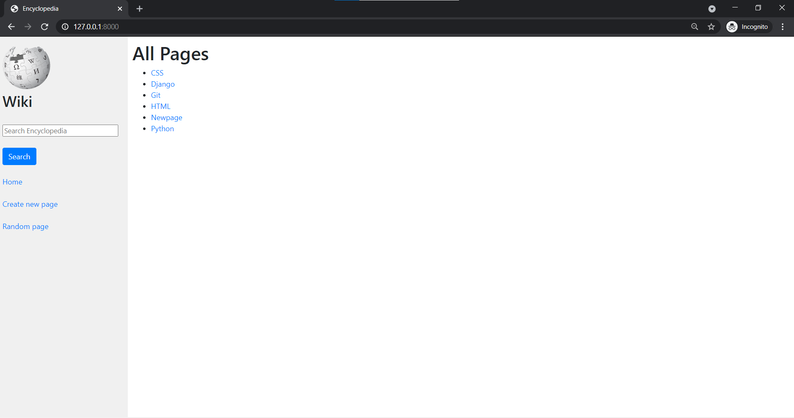
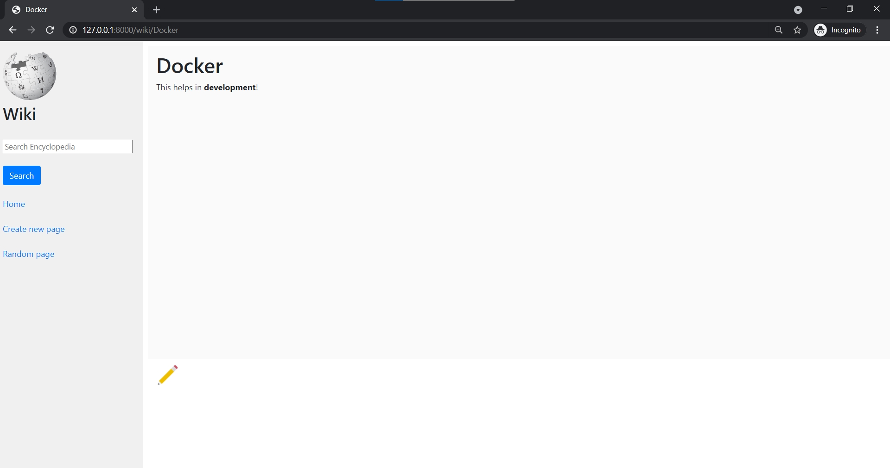
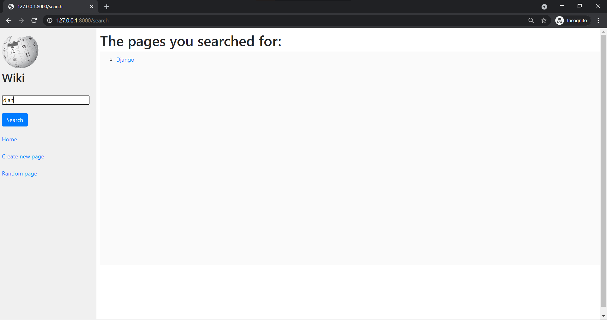
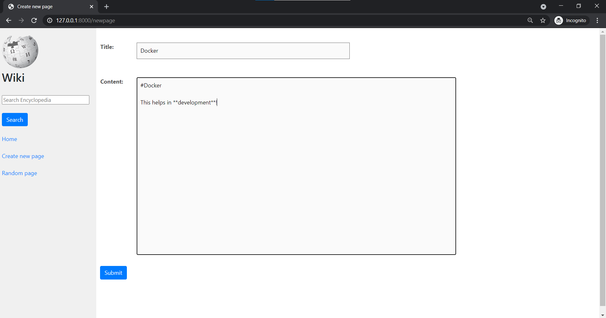
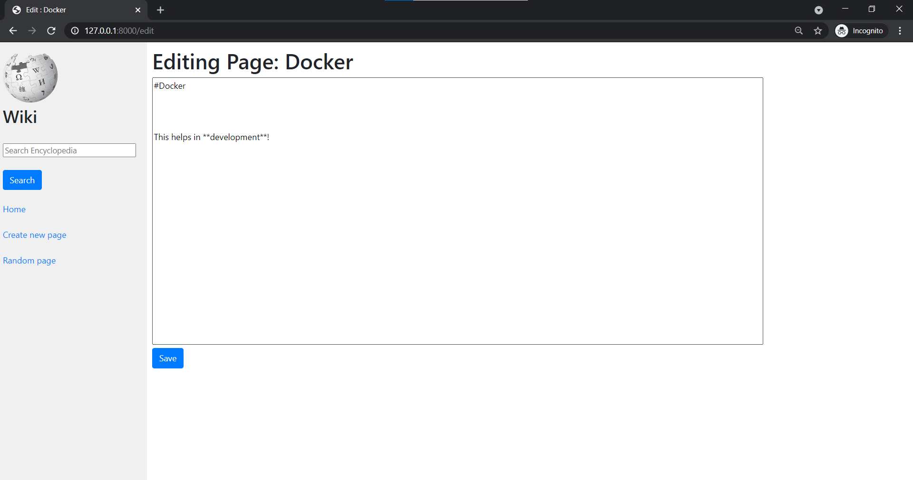
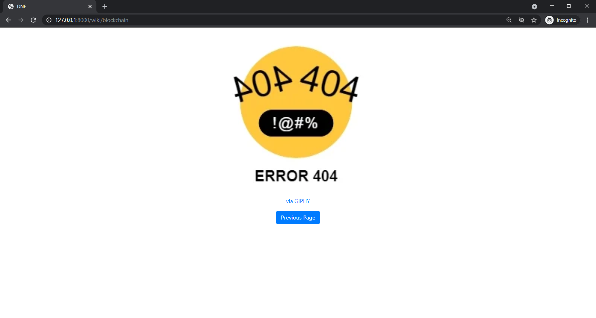

# Wiki
*Your own personalized encyclopedia*

### Decription
you can add information about your own pages(the pages you like) on this website and save them forever.
The pages you add here are in **markdown** language and this website converts the markdown language to HTML code!
just write the pages using the simple markdown rules and you get your pages formatted.
[Video link for the same project](https://www.youtube.com/watch?v=ElY56FQOH5Y)
## Features
1. Index page:
Here you can see all the pages that you created.

***
2. Page View:
You can see any of the page provided there on the index/home page just by clicking the link of that page.

***
3. Search:
You can search any of the page that you desire and if it belongs there it will show you in the search results and if it isn't there it will tell you that there isn't any of the pages there with the name provided.
You can also search the substring of the page then also it will appear in the results!

***
4. New Page:
You can any of the new page just by clicking on the new page link on the left side bar and then by providing the title of the new page and the content of the page in markdown language then clicking the submit button and it will then appear on the home page!

***
5. Edit page:
While creating a new page you got something worng written on the page? No worries this website got you covered, you can edit any of the pages present there.\

***
6. Random Page:
When you click on the **Random page** link, it seelcts one random page from all the pages and displays one of them.
***
7. DNE:
When go to a link like ```http://127.0.0.1:8000/wiki/apagethatdoesnotexist```, it will show you a does not exist message.

***

If you are curious that how to convert the md language to HTML then you should see the markdown2 documentation because in this project markdown2 module has been used to convert.
*** Usage
```bash
    python manage.py runserver
```

If you get an error that markdown2 is not installed then use the following command:
```bash
    pip install markdown2
```
Then run the first command and you will be able to run this perfectly.